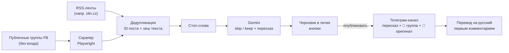

# zlin

Телеграм-бот, который следит за публичными группами Facebook города Злин (Чехия),
пересказывает новые посты через Gemini, отсеивает нерелевантное и после ручного
подтверждения публикует в телеграм-канал — с медиа и обязательной ссылкой на первоисточник.

> **Статус: этап 2 из 7** — скрапер работает на живой публичной группе без аккаунта,
> посты складываются в SQLite с двухуровневой дедупликацией. Бота и Gemini пока нет —
> см. [дорожную карту](#дорожная-карта). **Важно:** в первый же день Facebook закрыл доступ
> без логина для домашнего IP — см. [что известно](#что-известно-про-facebook-без-входа).

## Как это будет работать



Управление целиком из бота: добавить/выключить/удалить группу, стоп-слова, статистика,
очередь черновиков. Никаких правок конфигов руками после первого запуска.

## Жёсткие принципы

Скрейпинг Facebook хрупкий по природе, поэтому архитектура построена так, чтобы ломалось
предсказуемо и чинилось в одном месте:

1. **Никакого входа в Facebook.** Только публичные группы без аккаунта. Окно входа убирается
   из DOM — контент под ним уже загружен. Нечитаемая группа помечается `unavailable`, авторизация
   не обходится, CAPTCHA/checkpoint не решаются.
2. **Никаких CSS-классов** (`x1lku1pv` меняются каждую неделю) — только ARIA-роли, data-атрибуты,
   ссылки и встроенный JSON страницы.
3. **ID поста — из ссылки**: `/groups/<gid>/posts/<pid>`. Ключ `gid:pid`, где gid — канонический
   числовой ID группы (в ссылках одна и та же группа бывает и slug'ом, и числом).
4. **Вся логика извлечения — в одном модуле** [`zlinbot/fb/extract.py`](zlinbot/fb/extract.py)
   с чётким контрактом на выходе. Без сети и браузера, покрыт тестами на фикстурах.
5. **Все селекторы и регулярки — в одном файле** [`zlinbot/fb/selectors.py`](zlinbot/fb/selectors.py),
   у каждого комментарий, что он ловит.
6. **Вежливый темп** встроен в сам скрапер: одна загрузка за раз, 25–70 с между любыми двумя
   загрузками FB, круг раз в 15–25 минут с джиттером. Никакого параллелизма — в том числе между
   процессами: бот и отладочный скрипт делят один файл-замок ([`pace.py`](zlinbot/fb/pace.py)).

## Что известно про Facebook без входа

Проверено на живой группе «Události Zlín a okolí» (10,5 тыс. участников) 11.09.2026:

| Ожидание | Реальность |
|---|---|
| Верхние 25 постов ленты | **Один** пост + 2 пустые заглушки; подгрузки ленты нет вообще |
| `?sorting_setting=CHRONOLOGICAL` | Игнорируется, лента «Doporučené». Но видимый пост свежий (опоздание ~минуты) |
| `div[role="feed"] div[role="article"]` | Работает; комментарии тоже `article` — берём только верхний уровень |
| ID из ссылки регуляркой | Работает |
| Кнопка «Zobrazit více» | На самом деле «Zobrazit **víc**» — держим оба варианта |
| Дата поста | Видимая метка относительная («2 h»); точное время берётся из JSON страницы |
| Доступ без логина «годами» | **Через ~5,5 ч и ~40 загрузок за день** (пробы + замер в темпе 15–25 мин) FB начал уводить на `/login` **все** группы с этого IP (11.09.2026, 23:10) |
| Счётчик «Dnes N» — посты с полуночи | Колеблется вниз (21→20→21→19) — скользящее окно или удаления админами; семантика уточняется |

Отсюда два риска. Первый — в активной группе между кругами выходит больше одного поста, и часть
теряется: за 4 вечерних часа видимый пост был самым свежим с опозданием 8–15 минут. Второй,
более серьёзный, — стена логина для IP целиком: система на неё реагирует одной тревогой и
растущей паузой (группы при этом не помечаются недоступными), но длительность блокировки
и безопасный темп ещё предстоит измерить. RSS-источники от этого не зависят.

## Установка

Нужен **Python 3.13** (на 3.14+ не собирается `pydantic-core`) и Windows (запуск через `.bat` —
этап 7). Именно `py -3.13`: голый `python` может оказаться другой версией.

```bat
py -3.13 -m venv .venv
.venv\Scripts\python -m pip install -r requirements.txt
.venv\Scripts\python -m playwright install chromium
```

## Этап 1: как проверить

```bat
:: разовый прогон — печатает найденные посты
.venv\Scripts\python scripts\scrape.py https://www.facebook.com/groups/Zlin.Udalosti/

:: тесты на сохранённых фикстурах, без живого Facebook
.venv\Scripts\python -m pytest -q

:: замер покрытия: круги раз в 15–25 мин до Ctrl+C, CSV в watch_out\
.venv\Scripts\python scripts\scrape.py https://www.facebook.com/groups/Zlin.Udalosti/ --watch
```

Пример вывода разового прогона:

```
[ok] Zlin.Udalosti — Události Zlín a okolí (id 1028789523845607): статей 1, заглушек 2, без ID 0, постов 1
  #1 1028789523845607:28585844851046703 · Galerie T 2 Kroměříž · 2026-09-11 16:36 (2 h) · photo ×2
     https://www.facebook.com/groups/Zlin.Udalosti/posts/28585844851046703/
     A můžete navštívit i výstavu Všeslovanská epopej Ivana Mládka
     ↪ репост:
       Zítra to bude neskutečný. Marek Juras. Olejotisky. Zítra v 17:00
```

Статусы: `ok` · `no_feed` (стена логина или новая вёрстка) · `no_articles` (сменилась разметка
постов) · `no_ids` (сменились ссылки) · `login_wall` / `checkpoint` (FB увёл на вход — не обходим)
· `error`. При любом статусе кроме `ok` HTML страницы сохраняется в `debug\`.

## Этап 2: как проверить

База — `data\zlinbot.db` (путь меняется переменной `DB_PATH` в `.env`).

```bat
:: добавить группу: сначала проверяется, читается ли она без входа; видимые сейчас посты
:: уходят в «seen» — черновики будут только из появившихся позже
.venv\Scripts\python scripts\collect.py add https://www.facebook.com/groups/Zlin.Udalosti/

:: группы и их здоровье; круг сбора; круги каждые 15–25 мин
.venv\Scripts\python scripts\collect.py list
.venv\Scripts\python scripts\collect.py run
.venv\Scripts\python scripts\collect.py run --watch

:: что легло в БД (статусы: seen / new / duplicate / …), статистика и покрытие
.venv\Scripts\python scripts\collect.py posts --limit 10
.venv\Scripts\python scripts\collect.py posts --status duplicate
.venv\Scripts\python scripts\collect.py stats
```

Дедупликация: первый уровень — `post_id` (первичный ключ, повторный показ того же поста),
второй — SHA-1 первых 100 значащих символов (буквы и цифры без регистра, диакритики и ссылок):
одно объявление в трёх группах. Тексты короче 30 значащих символов по хешу не склеиваются.
У репоста с коротким своим комментарием («Sdílím») хеш берётся по расшаренному тексту.

Здоровье групп: если за круг не прочиталась ни одна группа — это глобальный сбой (FB закрыл
доступ нам): одна тревога, пауза растёт вдвое до 2 ч, группы не наказываются. Группа
помечается `unavailable`, только если проваливается 3 круга подряд, пока другие читаются;
перепроверяется раз в сутки.

## Когда Facebook переедет

1. Взять свежий дамп из `debug\` (или `watch_out\html\`).
2. Ужать его в фикстуру: `scripts\trim_fixture.py debug\<дамп>.html tests\fixtures\<случай>.html`
   (остаются только лента, `<title>` и нужные JSON-фрагменты — без JS Facebook и чужих данных).
3. Поправить селектор в `selectors.py` (или логику в `extract.py`), добавить тест, `pytest`.

## Структура

```
zlinbot/fb/selectors.py   все селекторы, регулярки, тексты интерфейса FB
zlinbot/fb/extract.py     HTML → FeedResult (посты, здоровье ленты); clean_text; счётчик активности
zlinbot/fb/scraper.py     Playwright: cookie-баннер, оверлей входа, «Zobrazit víc»
zlinbot/fb/pace.py        темп между процессами: файл-замок + время последней загрузки
zlinbot/db.py             SQLite: схема, миграции, все запросы
zlinbot/dedup.py          хеш первых 100 значащих символов
zlinbot/collector.py      круг сбора: база новой группы, дедупликация, здоровье групп, тревоги
zlinbot/config.py         .env: пути (позже — токены)
scripts/scrape.py         этап 1: разовый прогон и замер покрытия
scripts/collect.py        этап 2: группы и сбор в БД из командной строки (до появления бота)
scripts/trim_fixture.py   дамп страницы → компактная фикстура для тестов
tests/                    тесты на фикстурах и с поддельным скрапером — живой FB не нужен
```

Таблицы: `groups`, `posts` (сырьё + хеш + статус: `seen` / `new` / `duplicate` / `filtered` /
`skipped` / `pending` / `published` / `rejected` / `failed`), `drafts`, `filters`, `stats`
(журнал событий), `activity` (счётчик «Dnes N» для метрики покрытия), `settings`.

## Дорожная карта

- [x] **1. Скрапер** отдельным скриптом, тесты на фикстурах, замер покрытия
- [x] **2. БД и дедупликация** — SQLite; по `post_id` и по хешу первых ~100 значащих символов
      (одно объявление в трёх группах); новая группа — только новые посты; здоровье групп
- [ ] **RSS** как второй тип источника в том же конвейере
- [ ] **3. Gemini и фильтры** — стоп-слова из БД; JSON `{skip, post, facts, post_ru}`;
      8 с между вызовами, ретраи на 429, дневной лимит, ≤ 8 постов за круг; `/models`
- [ ] **4. Бот: черновики и кнопки** — опубликовать / переписать / отклонить / оригинал;
      защита от двойной публикации; только владелец
- [ ] **5. Медиа** — фото и mp4 до лимитов Bot API, media group ≤ 10; HLS/DASH не склеиваем
- [ ] **6. Админка** — `/groups`, `/add`, `/filters`, `/stats` (с покрытием), `/pending`, `/settings`
- [ ] **7. Обвязка** — `.bat` с проверкой Python и автосозданием venv, перезапуск упавших задач,
      ежедневная сводка (её отсутствие = машина спит)

## Ответственность

Проект читает только то, что Facebook сам показывает незалогиненному посетителю, в темпе
обычного человека. Условия использования Facebook запрещают автоматический сбор данных — при
таком объёме практический риск — блокировка IP, но решение запускать остаётся за владельцем.
Каждая публикация содержит ссылку на первоисточник; пересказ — не копия. Перепубликация чужих
фото и упоминание частных лиц в ЕС подпадают под авторское право и GDPR.
