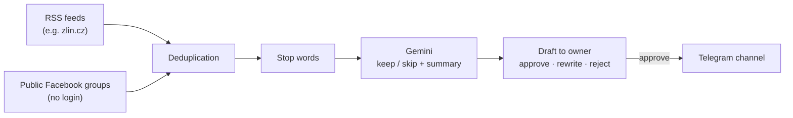

# zlin

A Telegram bot that runs a local news channel for Zlín, Czech Republic.

It watches local sources, uses Gemini to filter and summarise new posts, and sends each one to the owner as a draft. Nothing reaches the channel until the owner approves it. Every published post links back to its original source.

## What it's for

Local news in Zlín is scattered across city websites and public Facebook groups, mixed with ads, sales posts and noise. The bot collects it in one place, drops the irrelevant items, and turns the rest into short, readable posts in four languages — so one person can run the channel with a few taps a day.

## How it works

1. **Collect** — RSS feeds and public Facebook groups are checked on a slow, human-like schedule.
2. **Deduplicate** — the same story posted in several groups becomes one item.
3. **Filter** — stop words drop obvious noise; Gemini decides what is relevant and writes a 1–3 sentence summary.
4. **Review** — the owner gets a draft with the summary, translations, key facts to check against the original, and buttons: publish, rewrite, reject, view original.
5. **Publish** — the channel post has a topic emoji, the Czech summary, RU / UA / EN translations each under its own spoiler, photos or video, and a link to the source.

## Features

- **Human in the loop** — nothing is published automatically.
- **Four languages** — Czech, plus Russian, Ukrainian and English under spoilers. Place and organisation names stay in their original Czech spelling so readers recognise them on signs and maps.
- **No made-up facts** — the prompt requires amounts, dates and addresses to be copied exactly and private individuals not to be named.
- **Media** — photos and videos are downloaded when the draft is created (before Facebook's signed links expire) and kept within Telegram's file and caption limits. If media fails, the post still goes out as text.
- **Managed entirely from the bot** — add and remove sources, edit stop words, change the Gemini model and relevance criteria, view stats and the draft queue.
- **Reliability** — single-instance lock, auto-restart of crashed background tasks, notice when the machine was asleep, and a daily 9:00 summary that doubles as a heartbeat.
- **Owner-only access** — every update is checked against the owner's Telegram ID.

## Sources

- **RSS** — the main working source.
- **Facebook** — read only as a logged-out visitor, without bypassing login walls or CAPTCHAs. Since September 2026 Facebook has blocked logged-out access from the bot's IP; the bot pauses Facebook sources and keeps working on RSS.

## Responsible use

The bot only reads what Facebook shows to a logged-out visitor, at a human pace. Facebook's terms prohibit automated collection, so running it is the operator's decision. Posts are summaries, not copies, and always credit the source. Republishing photos and mentioning private people falls under EU copyright law and GDPR.

## Tech

Python 3.13 · aiogram 3 · Gemini API · Playwright · SQLite · Docker / Render
