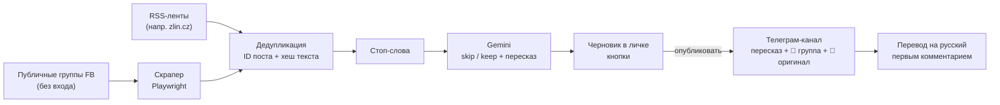

# zlin

Телеграм-бот, который следит за публичными группами Facebook города Злин (Чехия),
пересказывает новые посты через Gemini, отсеивает нерелевантное и после ручного
подтверждения публикует в телеграм-канал — с медиа и обязательной ссылкой на первоисточник.

> **Статус: все 7 этапов + RSS** — записи из источников складываются в SQLite с двухуровневой
> дедупликацией, общей для Facebook и RSS, разбираются через Gemini в черновики, а бот показывает
> их с кнопками и публикует в канал вместе с фото. Управление целиком в боте, запуск —
> одним `run.bat`. Подробности по этапам —
> [дорожную карту](#дорожная-карта). **Важно:** с 11.09.2026 Facebook закрыл доступ без логина
> для домашнего IP и не открыл его за четверо суток, поэтому рабочий источник сейчас — RSS.
> См. [что известно](#что-известно-про-facebook-без-входа).

## Как это будет работать



Управление целиком из бота: добавить/выключить/удалить группу, стоп-слова, статистика,
очередь черновиков. Никаких правок конфигов руками после первого запуска.

## Жёсткие принципы

Скрейпинг Facebook хрупкий по природе, поэтому архитектура построена так, чтобы ломалось
предсказуемо и чинилось в одном месте:

1. **Никакого входа в Facebook.** Только публичные группы без аккаунта. Окно входа убирается
   из DOM — контент под ним уже загружен. Нечитаемая группа помечается `unavailable`, авторизация
   не обходится, CAPTCHA/checkpoint не решаются.
2. **Никаких CSS-классов** (`x1lku1pv` меняются каждую неделю) — только ARIA-роли, data-атрибуты,
   ссылки и встроенный JSON страницы.
3. **ID поста — из ссылки**: `/groups/<gid>/posts/<pid>`. Ключ `gid:pid`, где gid — канонический
   числовой ID группы (в ссылках одна и та же группа бывает и slug'ом, и числом).
4. **Вся логика извлечения — в одном модуле** [`zlinbot/fb/extract.py`](zlinbot/fb/extract.py)
   с чётким контрактом на выходе. Без сети и браузера, покрыт тестами на фикстурах.
5. **Все селекторы и регулярки — в одном файле** [`zlinbot/fb/selectors.py`](zlinbot/fb/selectors.py),
   у каждого комментарий, что он ловит.
6. **Вежливый темп** встроен в сам скрапер: одна загрузка за раз, 25–70 с между любыми двумя
   загрузками FB, круг раз в 15–25 минут с джиттером. Никакого параллелизма — в том числе между
   процессами: бот и отладочный скрипт делят один файл-замок ([`pace.py`](zlinbot/fb/pace.py)).

## Что известно про Facebook без входа

Проверено на живой группе «Události Zlín a okolí» (10,5 тыс. участников) 11.09.2026:

| Ожидание | Реальность |
|---|---|
| Верхние 25 постов ленты | **Один** пост + 2 пустые заглушки; подгрузки ленты нет вообще |
| `?sorting_setting=CHRONOLOGICAL` | Игнорируется, лента «Doporučené». Но видимый пост свежий (опоздание ~минуты) |
| `div[role="feed"] div[role="article"]` | Работает; комментарии тоже `article` — берём только верхний уровень |
| ID из ссылки регуляркой | Работает |
| Кнопка «Zobrazit více» | На самом деле «Zobrazit **víc**» — держим оба варианта |
| Дата поста | Видимая метка относительная («2 h»); точное время берётся из JSON страницы |
| Доступ без логина «годами» | **Через ~5,5 ч и ~40 загрузок за день** (пробы + замер в темпе 15–25 мин) FB начал уводить на `/login` **все** группы с этого IP (11.09.2026, 23:10) |
| Блокировка временная, на часы | На 15.09 идут **четвёртые сутки**. Закрыты и группы, и страницы, и корень сайта — с этого IP не читается ничего, ни скрапером, ни обычным curl |
| Счётчик «Dnes N» — посты с полуночи | Колеблется вниз (21→20→21→19) — скользящее окно или удаления админами; семантика уточняется |

Обходить блокировку (VPN, смена адреса, мобильный интернет) проект не пытается: это тот же путь,
что и обход авторизации, и он превращает систему в гонку с Facebook. Код рассчитан на то, что
доступ может вернуться сам: источники FB не помечаются мёртвыми, а тип целиком уходит в паузу.

Отсюда два риска. Первый — в активной группе между кругами выходит больше одного поста, и часть
теряется: за 4 вечерних часа видимый пост был самым свежим с опозданием 8–15 минут. Второй,
более серьёзный, — стена логина для IP целиком: система на неё реагирует одной тревогой и
растущей паузой (группы при этом не помечаются недоступными), но длительность блокировки
и безопасный темп ещё предстоит измерить. RSS-источники от этого не зависят.

## Установка

Нужен **Python 3.13** (на 3.14+ не собирается `pydantic-core`) и Windows (запуск через `.bat` —
этап 7). Именно `py -3.13`: голый `python` может оказаться другой версией.

```bat
py -3.13 -m venv .venv
.venv\Scripts\python -m pip install -r requirements.txt
.venv\Scripts\python -m playwright install chromium
```

## Этап 1: как проверить

```bat
:: разовый прогон — печатает найденные посты
.venv\Scripts\python scripts\scrape.py https://www.facebook.com/groups/Zlin.Udalosti/

:: тесты на сохранённых фикстурах, без живого Facebook
.venv\Scripts\python -m pytest -q

:: замер покрытия: круги раз в 15–25 мин до Ctrl+C, CSV в watch_out\
.venv\Scripts\python scripts\scrape.py https://www.facebook.com/groups/Zlin.Udalosti/ --watch
```

Пример вывода разового прогона:

```
[ok] Zlin.Udalosti — Události Zlín a okolí (id 1028789523845607): статей 1, заглушек 2, без ID 0, постов 1
  #1 1028789523845607:28585844851046703 · Galerie T 2 Kroměříž · 2026-09-11 16:36 (2 h) · photo ×2
     https://www.facebook.com/groups/Zlin.Udalosti/posts/28585844851046703/
     A můžete navštívit i výstavu Všeslovanská epopej Ivana Mládka
     ↪ репост:
       Zítra to bude neskutečný. Marek Juras. Olejotisky. Zítra v 17:00
```

Статусы: `ok` · `no_feed` (стена логина или новая вёрстка) · `no_articles` (сменилась разметка
постов) · `no_ids` (сменились ссылки) · `login_wall` / `checkpoint` (FB увёл на вход — не обходим)
· `error`. При любом статусе кроме `ok` HTML страницы сохраняется в `debug\`.

## Этап 2: как проверить

База — `data\zlinbot.db` (путь меняется переменной `DB_PATH` в `.env`).

```bat
:: добавить группу: сначала проверяется, читается ли она без входа; видимые сейчас посты
:: уходят в «seen» — черновики будут только из появившихся позже
.venv\Scripts\python scripts\collect.py add https://www.facebook.com/groups/Zlin.Udalosti/

:: группы и их здоровье; круг сбора; круги каждые 15–25 мин
.venv\Scripts\python scripts\collect.py list
.venv\Scripts\python scripts\collect.py run
.venv\Scripts\python scripts\collect.py run --watch

:: что легло в БД (статусы: seen / new / duplicate / …), статистика и покрытие
.venv\Scripts\python scripts\collect.py posts --limit 10
.venv\Scripts\python scripts\collect.py posts --status duplicate
.venv\Scripts\python scripts\collect.py stats
```

Дедупликация: первый уровень — `post_id` (первичный ключ, повторный показ того же поста),
второй — SHA-1 первых 100 значащих символов (буквы и цифры без регистра, диакритики и ссылок):
одно объявление в трёх группах. Тексты короче 30 значащих символов по хешу не склеиваются.
У репоста с коротким своим комментарием («Sdílím») хеш берётся по расшаренному тексту.

Здоровье источников считается **отдельно по типу**. Если за круг не прочитался ни один источник
типа — это глобальный сбой (например, стена логина в FB): одна тревога, пауза для этого типа
растёт вдвое до 2 ч, источники не наказываются, а остальные типы работают дальше. Без этого
живой RSS во время блокировки FB «доказывал» бы, что остальные читаются, и все группы уехали бы
в `unavailable`. Источник помечается `unavailable`, только если проваливается 3 круга подряд,
пока другие источники того же типа читаются; перепроверяется раз в сутки.

## RSS как второй источник

```bat
:: тот же конвейер: дедупликация, статусы, статистика
.venv\Scripts\python scripts\collect.py add https://zlin.cz/feed/
```

- Разбор снисходительный (bs4), а не строгий XML: у `zlin.cz` не объявлен префикс `szn:`,
  и штатный `xml.etree` на этом фиде падает целиком.
- Ключ записи — `rss:<хеш guid>`, не меняется между разборами.
- В текст идёт заголовок плюс анонс (у zlin.cz это 165–360 символов — Gemini хватит);
  HTML из анонса вычищается. Если анонса нет, остаётся один заголовок.
- Условный запрос по `ETag`/`Last-Modified`: если лента не менялась, сервер ответит 304.
- Одна и та же картинка приходит в `enclosure` и в `media:content` разного размера —
  остаётся одна, полного размера.

## Этап 3: как проверить

Нужен ключ Gemini: положи `GEMINI_API_KEY=...` в `.env` (образец — `.env.example`).
Без ключа работают только стоп-слова и тесты.

```bat
:: стоп-слова: дешёвый отсев до обращения к модели
.venv\Scripts\python scripts\collect.py filters --add prodám
.venv\Scripts\python scripts\collect.py filters --rm 1

:: разобрать накопленное: стоп-слова -> Gemini -> черновики (не больше 8 записей за раз)
.venv\Scripts\python scripts\collect.py process

:: очередь готовых черновиков и реальный список моделей у API
.venv\Scripts\python scripts\collect.py drafts
.venv\Scripts\python scripts\collect.py models
```

Что требует промт: не выдумывать; суммы, даты, адреса и номера переносить дословно; пересказ
по-чешски в 1–3 предложения; `post_ru` — он же по-русски; `facts` — 1–3 факта по-чешски для
сверки с оригиналом; не называть по имени частных лиц. Критерии отбора хранятся в таблице
`settings` (ключ `relevance`) и будут правиться из бота.

Ответ просим строго JSON (`responseMimeType` + схема), но разбор терпит и ```` ```json ````-обёртку,
и пояснения вокруг JSON. Лимиты бесплатного тарифа: пауза 8 секунд между вызовами, три ретрая
на 429 с задержками 8/20/45 секунд.

Три вида сбоя разведены, потому что реагировать на них надо по-разному:

| Что случилось | Что делает система |
|---|---|
| Суточная квота (429 per day) | Ретраи бессмысленны: разбор встаёт до полуночи по Тихоокеанскому, сбор продолжается, записи ждут в очереди |
| 400/403 (модель снята, ключ не принят) | Круг останавливается с тревогой: само не пройдёт, нужно чинить настройки |
| Фильтр безопасности, пустой ответ, мусор вместо JSON | Помечается одна запись (`failed`), разбор идёт дальше |

## Этап 4: как проверить

Кнопки проверяются прогоном апдейтов через настоящий диспетчер с моком бота — токен не нужен:

```bat
.venv\Scripts\python -m pytest -q tests\test_bot.py
```

Живой запуск (нужны `BOT_TOKEN`, `ADMIN_ID`, `CHANNEL_ID` в `.env`):

```bat
.venv\Scripts\python scripts\bot.py
```

Что делает бот:

- присылает карточку черновика: пересказ, перевод, факты для сверки и кнопки
  «Опубликовать», «Переписать», «Отклонить», «Оригинал»;
- публикует в канал в формате из ТЗ — пересказ, `📍` источник, `🔗` ссылка на оригинал,
  превью ссылки отключено;
- перевод кладёт первым комментарием через привязанную группу обсуждений, а если её нет —
  под спойлером в самом посте (это определяется при старте);
- «Переписать» спрашивает, что поправить, и даёт кнопку «просто заново»; старая версия
  черновика помечается `superseded`, новая приходит отдельной карточкой.

**Защита от двойной публикации** — не проверка в памяти, а атомарная смена статуса в БД
(`pending → publishing`): кто успел, тот и публикует, второму приходит «уже опубликован».
Если Telegram отказал, статус возвращается в `pending`, и кнопку можно нажать снова.

**Доступ.** Проверка владельца стоит внешним middleware на всём диспетчере, а не фильтром на
каждом хендлере: забыть фильтр на новом хендлере легко, пропустить middleware — нет. Чужой
user_id не может нажать ни одну кнопку. Единственное исключение — служебная пересылка поста
в группу обсуждений: её делает сам Telegram, и без неё не оставить перевод комментарием.

**Проверки при старте** (иначе всплывут молчанием в канале): бот — админ канала? может
публиковать? привязана ли группа обсуждений? админ ли он в ней (иначе Telegram может не
показать ему служебную пересылку, и перевод комментарием не уйдёт). Всё найденное приходит
владельцу одним сообщением при запуске.

## Этап 5: медиа

Фото и видео скачиваются **в момент создания черновика**, а не публикации: ссылки Facebook
подписаны и протухают за несколько дней, а черновик столько может ждать решения. Файлы лежат
в `media\draft_<id>\` и удаляются, как только решение принято.

Границы Bot API заложены сразу:

| Граница | Что делает система |
|---|---|
| media group — 10 файлов | лишние не отправляются, в карточке черновика видно «пойдёт 10 из 13» |
| фото до 10 МБ, видео до 50 МБ | проверяется по `Content-Length`, а если сервер его не прислал — по ходу скачивания |
| видео как HLS/DASH (`.m3u8`, `.mpd`) | не склеиваем сегменты: видео пропускается, ссылка на оригинал остаётся |
| подпись к медиа — 1024 символа | длинный пересказ уходит отдельным сообщением следом за альбомом |
| Telegram не принял файл | пост всё равно выходит текстом — терять новость из-за картинки нельзя |

Режим `media_mode` в настройках: `copy` (переносить, по умолчанию) или `link` (только ссылка).

## Этап 6: админка

Всё управление — из бота, конфиги руками после первого запуска не правятся.

| Команда | Что делает |
|---|---|
| `/pending` | очередь черновиков с кнопками |
| `/groups` | источники со статусом: пауза, «проверить сейчас», удалить (с подтверждением) |
| `/add` | присылаешь ссылку — бот проверяет доступность и только потом добавляет |
| `/filters` | стоп-слова: добавить, удалить |
| `/stats` | собрано, дубли, отсеяно стоп-словами, Gemini skip, черновики, опубликовано, отклонено — за сутки и за неделю; очередь; покрытие Facebook |
| `/settings` | медиа (переносить / только ссылка), модель, критерии отбора |
| `/models` | реальный список моделей у API |
| `/cancel` | выйти из любого пошагового ввода |

Модель, критерии и режим медиа живут в таблице `settings`, а не в `.env`: их можно менять
на ходу, и они переживают перезапуск. Chromium поднимается лениво — только когда правда
понадобился Facebook, а не при старте бота.

## Этап 7: запуск и присмотр

```bat
run.bat
```

Он сам проверит Python 3.13, создаст venv, поставит зависимости и Chromium, при отсутствии
`.env` откроет его в блокноте, а упавшего бота перезапустит через 15 секунд.

Файл намеренно **только на латинице**: cmd читает `.bat` в кодировке OEM, и кириллица в нём
ломает разбор команд — проверено, первая версия падала с «'on.org' is not recognized».
Всё, что читает человек, печатает Python.

Что появилось вместе с ним:

- **Замок одного экземпляра.** Два бота молча конфликтуют: Telegram отдаёт обновления
  одному, и перестают отвечать оба. Теперь второй запуск сразу скажет, какой процесс уже
  работает, и не стартует.
- **Присмотр за фоновыми задачами.** Упавшая задача логируется, пишет тебе в личку и
  перезапускается с нарастающей паузой (30 с → 2 мин → 10 мин), а когда оживёт — сообщит.
- **Расписание по настенным часам.** Ноутбук засыпает, и таймер во сне не идёт. Ожидание
  разбито на короткие отрезки со сверкой по часам: проснувшись, круг идёт сразу, а про сам
  сон дольше 10 минут приходит сообщение — всё это время канал молчал.
- **Ежедневная сводка в 9:00 по Праге.** Смысл не в цифрах, а в факте письма: не пришло —
  значит, бот не работает. Молчание канала само по себе ни о чём не говорит.

Сбор, разбор и бот теперь живут в одном процессе: черновики приходят сами, без `collect.py`.

## Деплой на Render

В репозитории готовы [`Dockerfile`](Dockerfile), [`render.yaml`](render.yaml) и `.dockerignore`.
Деплой: запушить в GitHub → в Render **New → Blueprint** → выбрать репозиторий → заполнить
секреты (`BOT_TOKEN`, `ADMIN_ID`, `CHANNEL_ID`, `GEMINI_API_KEY`). В git их нет: в блюпринте
они помечены `sync: false`.

Что нужно знать заранее:

| Что | Почему так |
|---|---|
| Это **background worker**, а не web service | Бесплатный веб-сервис засыпает через 15 минут без входящих запросов — бот будет молчать почти всегда. Воркеров на бесплатном тарифе у Render нет, нужен платный план |
| Нужен **диск** (`/data`, 1 ГБ) | Файловая система контейнера эфемерная: без диска SQLite и кэш медиа сотрутся при каждом деплое. Диски тоже только на платных планах |
| **Chromium по умолчанию не ставится** | Facebook почти наверняка встретит датацентровый адрес стеной логина — он закрыт даже для домашнего IP. Это минус ~500 МБ образа. Нужен FB — собирай с `--build-arg INSTALL_CHROMIUM=true` |
| **Не запускай бота дома и на Render одновременно** | Замок одного экземпляра работает только в пределах машины. Два бота с одним токеном конфликтуют в Telegram, и оба перестают отвечать |
| Часовой пояс контейнера — UTC | Код это учитывает: дни и сводка считаются по `Europe/Prague`, пакет `tzdata` в зависимостях |

Если платить не хочется, домашний вариант с `run.bat` остаётся рабочим — со всеми оговорками
про сон машины и перезагрузки Windows, ради которых и сделаны сводка и учёт сна.

## Когда Facebook переедет

1. Взять свежий дамп из `debug\` (или `watch_out\html\`).
2. Ужать его в фикстуру: `scripts\trim_fixture.py debug\<дамп>.html tests\fixtures\<случай>.html`
   (остаются только лента, `<title>` и нужные JSON-фрагменты — без JS Facebook и чужих данных).
3. Поправить селектор в `selectors.py` (или логику в `extract.py`), добавить тест, `pytest`.

## Структура

```
zlinbot/fb/selectors.py   все селекторы, регулярки, тексты интерфейса FB
zlinbot/fb/extract.py     HTML → FeedResult (посты, здоровье ленты); clean_text; счётчик активности
zlinbot/fb/scraper.py     Playwright: cookie-баннер, оверлей входа, «Zobrazit víc»
zlinbot/fb/pace.py        темп между процессами: файл-замок + время последней загрузки
zlinbot/rss.py            RSS/Atom: разбор лент и условные запросы
zlinbot/filters.py        стоп-слова: сравнение без регистра и диакритики
zlinbot/gemini.py         промт, разбор ответа, лимиты и виды сбоя
zlinbot/pipeline.py       стоп-слова -> Gemini -> черновик, не больше 8 записей за круг
zlinbot/media.py          скачивание медиа, лимиты Bot API, кэш и уборка
zlinbot/db.py             SQLite: схема, миграции, все запросы
zlinbot/dedup.py          хеш первых 100 значащих символов
zlinbot/collector.py      круг сбора: база нового источника, дедупликация, здоровье по типам, тревоги
zlinbot/config.py         .env: пути, ключи, токены
zlinbot/supervisor.py     фоновые задачи: перезапуск после падения, учёт сна машины
zlinbot/single.py         замок одного экземпляра
zlinbot/digest.py         ежедневная сводка
zlinbot/bot/texts.py      тексты бота и формат поста в канале
zlinbot/bot/keyboards.py  кнопки; в callback_data идёт только id строки БД (лимит 64 байта)
zlinbot/bot/access.py     доступ только владельцу — middleware на всём диспетчере
zlinbot/bot/publisher.py  публикация, защита от двойного нажатия, перевод комментарием
zlinbot/bot/handlers.py   черновики: карточки и кнопки
zlinbot/bot/admin.py      источники, стоп-слова, статистика, настройки
zlinbot/bot/app.py        сборка бота и проверки при старте
scripts/scrape.py         этап 1: разовый прогон и замер покрытия
scripts/collect.py        этапы 2–3: источники, сбор и разбор из командной строки
scripts/bot.py            запуск: бот, сбор и разбор в одном процессе
run.bat                   запуск на Windows: venv, зависимости, автоперезапуск
Dockerfile, render.yaml   деплой на Render (background worker + диск)
scripts/trim_fixture.py   дамп страницы → компактная фикстура для тестов
tests/                    тесты на фикстурах и с поддельным скрапером — живой FB не нужен
```

Таблицы: `groups`, `posts` (сырьё + хеш + статус: `seen` / `new` / `duplicate` / `filtered` /
`skipped` / `pending` / `published` / `rejected` / `failed`), `drafts`, `filters`, `stats`
(журнал событий), `activity` (счётчик «Dnes N» для метрики покрытия), `settings`.

## Дорожная карта

- [x] **1. Скрапер** отдельным скриптом, тесты на фикстурах, замер покрытия
- [x] **2. БД и дедупликация** — SQLite; по `post_id` и по хешу первых ~100 значащих символов
      (одно объявление в трёх группах); новая группа — только новые посты; здоровье групп
- [x] **RSS** как второй тип источника в том же конвейере (`zlin.cz` подключён и работает)
- [x] **3. Gemini и фильтры** — стоп-слова из БД; JSON `{skip, post, facts, post_ru}`;
      8 с между вызовами, ретраи на 429, дневной лимит, ≤ 8 записей за круг; список моделей
- [x] **4. Бот: черновики и кнопки** — опубликовать / переписать / отклонить / оригинал;
      защита от двойной публикации; только владелец; перевод первым комментарием
- [x] **5. Медиа** — фото и mp4 до лимитов Bot API, media group ≤ 10; HLS/DASH не склеиваем
- [x] **6. Админка** — `/groups`, `/add`, `/filters`, `/stats` (с покрытием), `/pending`, `/settings`
- [x] **7. Обвязка** — `.bat` с проверкой Python и автосозданием venv, перезапуск упавших задач,
      ежедневная сводка (её отсутствие = машина спит), замок одного экземпляра
- [x] **Деплой** — Dockerfile и render.yaml для Render (background worker + диск)

## Ответственность

Проект читает только то, что Facebook сам показывает незалогиненному посетителю, в темпе
обычного человека. Условия использования Facebook запрещают автоматический сбор данных — при
таком объёме практический риск — блокировка IP, но решение запускать остаётся за владельцем.
Каждая публикация содержит ссылку на первоисточник; пересказ — не копия. Перепубликация чужих
фото и упоминание частных лиц в ЕС подпадают под авторское право и GDPR.
